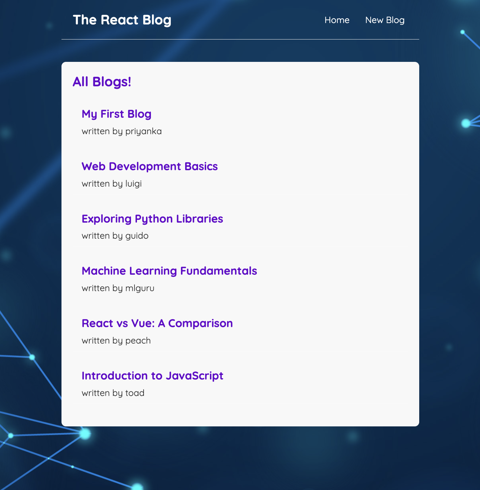
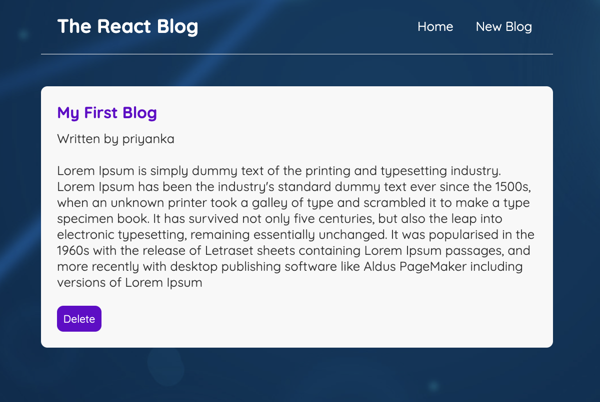
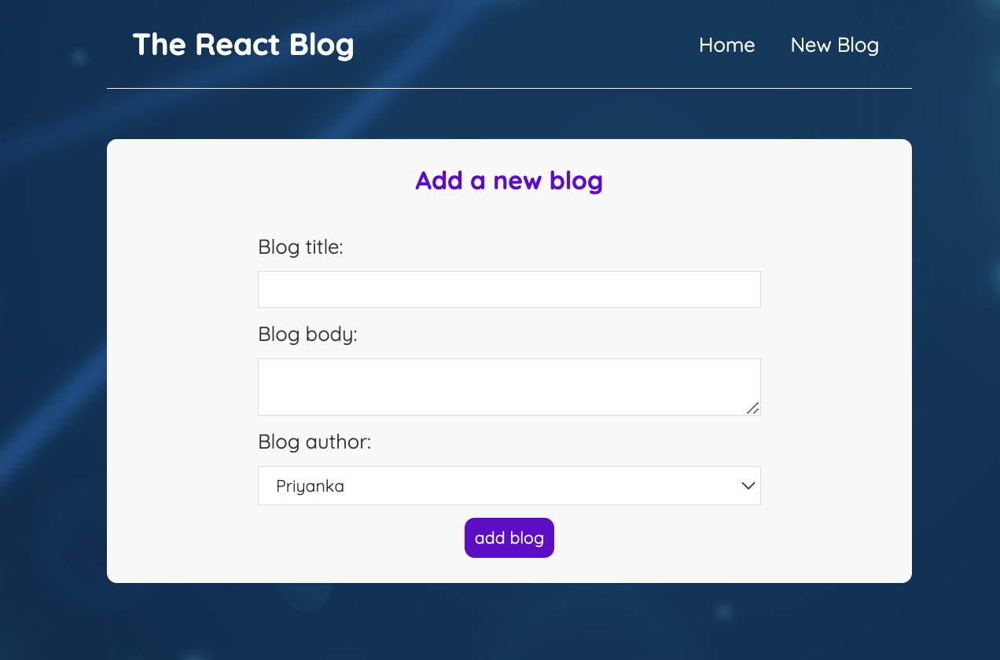

# React Blog App with JSON Server

This is a simple React application for managing and displaying blog content. It uses React Router for navigation and styling with SCSS. The blog data is managed using a JSON server.

## Getting Started

## Features
- Seamlessly navigate through the app with React Router, ensuring smooth transitions between different sections.
- Enjoy a curated showcase of captivating blog previews on the home page, offering a glimpse into the wide range of available content.
- Craft and publish your own insightful blogs using the Create page, fostering an environment of creativity and knowledge-sharing.
- Immerse yourself in the depth of individual blog narratives on the BlogDetails page, allowing readers to connect deeply with each story.
- Efficiently manage and maintain the flow of data with a JSON server, streamlining the creation, reading, and deletion of blog content.
- Handle unexpected navigational scenarios gracefully with the PageNotFound component, ensuring a seamless user experience even in rare situations.





In the project directory, you can run:

### `npm start`

Runs the app in the development mode.\
Open [http://localhost:3000](http://localhost:3000) to view it in your browser.

The page will reload when you make changes.\
You may also see any lint errors in the console.

### `npm test`

Launches the test runner in the interactive watch mode.\
See the section about [running tests](https://facebook.github.io/create-react-app/docs/running-tests) for more information.

### `npm run build`

Builds the app for production to the `build` folder.\
It correctly bundles React in production mode and optimizes the build for the best performance.

The build is minified and the filenames include the hashes.\
Your app is ready to be deployed!

See the section about [deployment](https://facebook.github.io/create-react-app/docs/deployment) for more information.

## JSON Server
The blog data is managed using a JSON server. To start the JSON server, run:

```bash
npx json-server --watch data/db.json --port 8000
```
